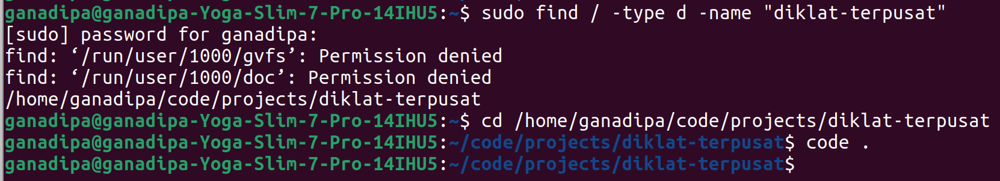
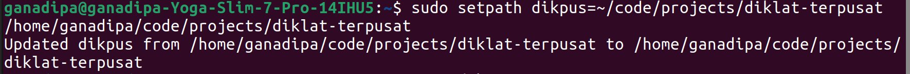

You dont wanna do this everytime, are you ?


do this instead!


then everytime you open up your computer, just type
```bash
vscp dikpus
```

then it automatically opens up vs code for you!


How?
```bash
g++ -o setpath setpath.cpp
g++ -o vscp vscp.cpp
```

```bash
sudo mv setpath /bin
sudo mv vscp /bin
```

